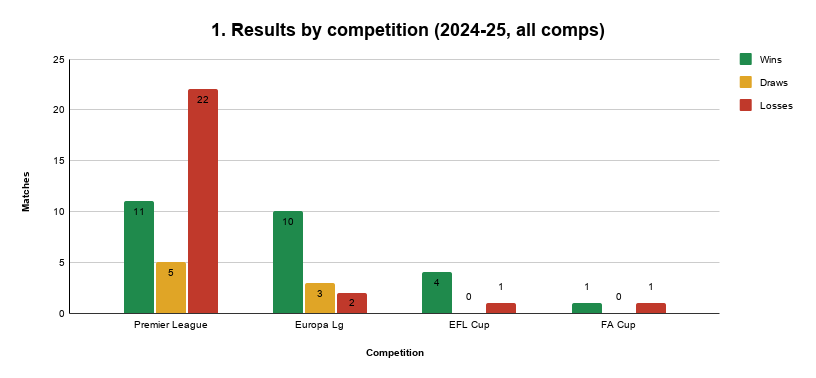
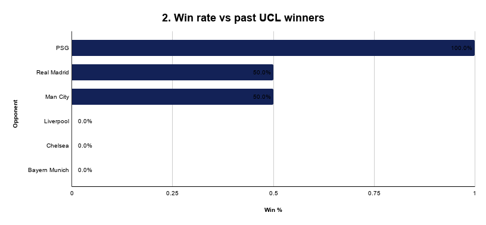
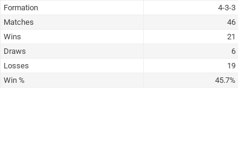
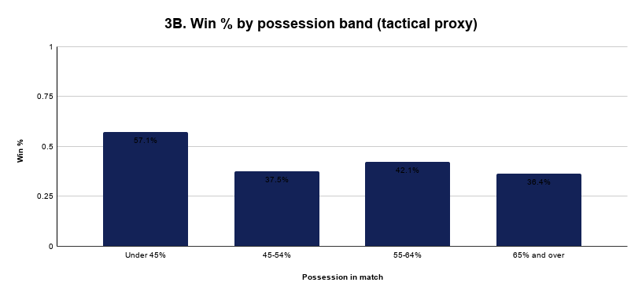
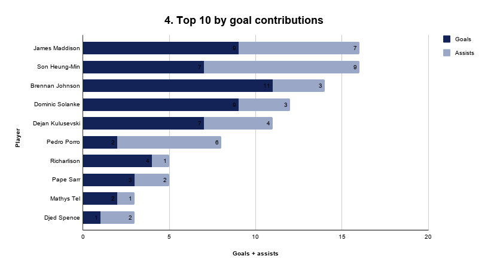

# Can Tottenham Win the 2026 UCL Final?

I used PostgreSQL and football performance data to evaluate whether Tottenham Hotspur possessed the statistical profile required to compete for the 2026 UEFA Champions League title. The analysis combines match performance, player contributions, tactical formations, and results against previous Champions League winners to identify strengths, weaknesses, and indicators of title competitiveness.

## Tools:
- PostgreSQL
- SQL
- Excel
- pgAdmin

## Project Type:
- Sports Analytics
- SQL
- Football Intelligence

---

## Data Sources

- Match results, xG, xGA, team stats — FBRef (selected season, all competitions)
- Player stats — WhoScored
- Formations, passing %, PPDA, etc. — Understat or WhoScored
- Opponent team stats — FBRef team pages
- Future fixtures — UEFA.com
- Advanced metrics, where applicable — StatsBomb Open Data or Kaggle Football Datasets

---

## Introduction

This project uses SQL to assess whether Tottenham Hotspur can realistically win the UEFA Champions League by analyzing their performance data, player contributions, tactical success, and head-to-head records against elite European clubs.

The analysis combines multiple relational datasets to uncover performance trends, tactical patterns, and Tottenham's competitiveness against teams with previous Champions League success.

---

## 🧠 Key Questions

- 🧠 Historical win rate against past UCL winners
- 📊 Average xG, possession, goal difference across matches
- ⚔️ Tactical formations and match performance
- 👥 Player contributions
- 🏆 Tottenham's performance across domestic and European competitions

---

# 🗂️ Data Schema

The project uses multiple relational datasets to analyze Tottenham's performance across team, player, tactical, and competition-level data.

### `match_results`
Match-level information including:
- Date
- Competition
- Opponent
- Result
- Goals
- xG
- xGA
- Possession
- Passing percentage

### `player_stats`
Individual player performance metrics including:
- Goals
- Assists
- xG
- Tackles
- Passing
- Rating
- Other player-level statistics

### `ucl_contenders`
Statistics used to compare Tottenham with other Champions League contenders.

### `tactics`
Formation and tactical information used to evaluate Tottenham's performance within their primary tactical setup.

### `performance_against_ucl_winners`
Tottenham's historical results against selected clubs that have previously won the UEFA Champions League.

---

# 📊 The Analysis

## Results: All Competitions & Previous UCL Winners

### Overall Win Percentage

| Total Matches | Total Wins | Win Percentage |
| :-----------: | :--------: | :------------: |
| 60 | 26 | 43.33% |



### Record Across All Competitions

| Total Matches | Total Wins | Total Losses | Total Draws |
| :-----------: | :--------: | :----------: | :---------: |
| 60 | 26 | 26 | 8 |

### Goals Across All Competitions

| Total Goals |
| :---------: |
| 105 |

---

# 🏆 Performance Against Previous Champions League Winners

## Record Against the Past Six UCL Winners

| Total Matches | Total Wins | Total Losses | Total Draws | Win Percentage |
| :-----------: | :--------: | :----------: | :---------: | :------------: |
| 11 | 3 | 7 | 1 | 27.27% |



This analysis compares Tottenham's results against selected clubs that have previously won the UEFA Champions League.

Tottenham recorded wins against several previous Champions League winners in the analyzed matches, while recording less favorable results against others.

Because the number of matches against individual opponents is limited, these percentages represent historical match outcomes rather than a measure of overall team superiority.

---

# 🏟️ Competition Performance

## Europa League

| Total Goals |
| :---------: |
| 28 |

### Europa League Record

| Total Matches | Total Wins | Total Losses | Total Draws | Win Percentage |
| :-----------: | :--------: | :----------: | :---------: | :------------: |
| 15 | 10 | 2 | 3 | 66.67% |

---

## Premier League

| Total Matches | Total Wins | Total Losses | Total Draws | Win Percentage |
| :-----------: | :--------: | :----------: | :---------: | :------------: |
| 38 | 11 | 22 | 5 | 28.95% |

### Premier League Goals

| Total Goals |
| :---------: |
| 64 |

The European record was considerably stronger than Tottenham's Premier League record in the analyzed dataset, with a 66.67% win rate in the Europa League compared with a 28.95% win rate in the Premier League.

---

# ⚽ Tactical Analysis

## Angeball: 4-3-3 Formation

| Favorite Formation | Total Matches | Total Wins | Total Losses | Total Draws | Win Percentage |
| :----------------: | :-----------: | :--------: | :----------: | :---------: | :------------: |
| 4-3-3 | 46 | 21 | 19 | 6 | 45.65% |



Tottenham used a 4-3-3 formation throughout the analyzed dataset, recording a 45.65% win rate across 46 matches.

Because Tottenham used the same formation throughout the dataset, this analysis describes the team's performance while using a 4-3-3 rather than comparing multiple formations.

---

## 📊 Win Rate by Possession



The possession analysis examines whether Tottenham's percentage of possession corresponded with a higher win rate.

The results suggest that possession percentage alone was not a reliable indicator of match success within this dataset.

---

# 💡 Insights

- Tottenham failed to have a winning record and underperformed in the majority of their competitions, with the Europa League representing the strongest exception.
- Tottenham recorded a 45.65% win rate while using their primary 4-3-3 formation.
- Tottenham struggled against previous Champions League winners, recording a 27.27% win rate across the analyzed matches.
- The European record was significantly stronger than Tottenham's Premier League record in this dataset.
- Possession did not consistently correspond with a higher win rate.

---

# 👤 Player Performance

## Top 10 Players by Goal Contributions



This visualization highlights Tottenham's leading contributors based on combined goals and assists.

The analysis provides a player-level view of the individuals contributing most directly to Tottenham's attacking output.

---

# 💻 SQL Code

The project uses PostgreSQL and SQL to analyze Tottenham's performance across multiple dimensions.

The SQL analysis includes:

- Overall match performance
- Competition-level results
- Player statistics
- Goal contributions
- Tactical formations
- Possession
- Performance against previous Champions League winners
- Team and player comparisons

## Overall Win Percentage

```sql
SELECT 
    COUNT(*) AS total_matches,
    SUM(CASE WHEN result = 'W' THEN 1 ELSE 0 END) AS total_wins,
    ROUND(
        100.0 * SUM(CASE WHEN result = 'W' THEN 1 ELSE 0 END) / COUNT(*),
        2
    ) AS win_percentage
FROM match_results;
```

## Win Rate Against UCL Winners

```sql
SELECT
    COUNT(*) AS total_matches,
    SUM(CASE WHEN result = 'W' THEN 1 ELSE 0 END) AS total_wins,
    SUM(CASE WHEN result = 'L' THEN 1 ELSE 0 END) AS total_losses,
    SUM(CASE WHEN result = 'D' THEN 1 ELSE 0 END) AS total_draws,
    ROUND(
        100.0 * SUM(CASE WHEN result = 'W' THEN 1 ELSE 0 END) / COUNT(*),
        2
    ) AS win_percentage
FROM performance_against_ucl_winners;
```

## Performance Against Individual UCL Winners

```sql
SELECT 
    opponent,
    COUNT(*) AS total_matches,
    SUM(CASE WHEN result = 'W' THEN 1 ELSE 0 END) AS wins,
    SUM(CASE WHEN result = 'L' THEN 1 ELSE 0 END) AS losses,
    SUM(CASE WHEN result = 'D' THEN 1 ELSE 0 END) AS draws,
    ROUND(
        100.0 * SUM(CASE WHEN result = 'W' THEN 1 ELSE 0 END) / COUNT(*),
        2
    ) AS win_percentage
FROM performance_against_ucl_winners
GROUP BY opponent
ORDER BY win_percentage DESC;
```

## Competition Performance

```sql
SELECT 
    competition,
    COUNT(*) AS total_matches,
    SUM(CASE WHEN result = 'W' THEN 1 ELSE 0 END) AS wins,
    SUM(CASE WHEN result = 'L' THEN 1 ELSE 0 END) AS losses,
    SUM(CASE WHEN result = 'D' THEN 1 ELSE 0 END) AS draws,
    ROUND(
        100.0 * SUM(CASE WHEN result = 'W' THEN 1 ELSE 0 END) / COUNT(*),
        2
    ) AS win_percentage
FROM match_results
GROUP BY competition
ORDER BY win_percentage DESC;
```

## Formation Analysis

```sql
SELECT 
    formation,
    COUNT(*) AS total_matches,
    SUM(CASE WHEN result = 'W' THEN 1 ELSE 0 END) AS wins,
    SUM(CASE WHEN result = 'L' THEN 1 ELSE 0 END) AS losses,
    SUM(CASE WHEN result = 'D' THEN 1 ELSE 0 END) AS draws,
    ROUND(
        100.0 * SUM(CASE WHEN result = 'W' THEN 1 ELSE 0 END) / COUNT(*),
        2
    ) AS win_percentage
FROM tactics
GROUP BY formation
ORDER BY win_percentage DESC;
```

## Possession Analysis

```sql
SELECT
    CASE
        WHEN possession < 45 THEN 'Under 45%'
        WHEN possession BETWEEN 45 AND 54 THEN '45-54%'
        WHEN possession BETWEEN 55 AND 64 THEN '55-64%'
        ELSE '65%+'
    END AS possession_band,
    COUNT(*) AS total_matches,
    SUM(CASE WHEN result = 'W' THEN 1 ELSE 0 END) AS wins,
    ROUND(
        100.0 * SUM(CASE WHEN result = 'W' THEN 1 ELSE 0 END) / COUNT(*),
        2
    ) AS win_percentage
FROM match_results
GROUP BY possession_band
ORDER BY possession_band;
```

## Player Goal Contributions

```sql
SELECT
    player,
    goals,
    assists,
    goals + assists AS goal_contributions
FROM player_stats
ORDER BY goal_contributions DESC
LIMIT 10;
```

---

# 🧠 What I Learned — Tottenham UCL Prediction SQL Project

- Match-level data (xG, xGA, possession, pass %, etc.) gives deeper insight into team consistency and quality of play beyond a simple win/loss result.
- Creating multiple relational tables such as `match_results`, `player_stats`, `tactics`, and `ucl_contenders` helped simulate a scouting-style analytical workflow.
- Aggregating team performance against past UCL winners was particularly useful for understanding competitiveness at a European level.
- I reinforced my skills in joining data, conditionally counting using `CASE WHEN`, and calculating percentage-based metrics.
- Using `ROUND()`, `SUM()`, and `COUNT()` allowed me to create statistical summaries and performance tables.

---

# 🧾 Conclusion

By analyzing Tottenham's recent performances alongside UCL winner trends and competitor statistics, I used SQL to investigate their ability to compete at Champions League level.

The analysis combines historical match performance, player contributions, tactical information, possession patterns, and results against elite European opposition.

Tottenham struggled across the majority of competitions in the analyzed dataset, particularly in the Premier League, while their Europa League performance was considerably stronger.

Their 27.27% win rate against the selected previous Champions League winners also suggests that competing consistently against elite European opposition remains a significant challenge.

With changes to recruitment, coaching, squad quality, and tactical approach, Tottenham could improve their competitiveness in future Champions League campaigns.

COYS! ⚪️

---

# ⚠️ Limitations

- The analysis is based on a defined sample of Tottenham matches and does not capture every possible performance variable.
- Results against individual Champions League winners are based on a limited number of matches.
- Possession and formation analysis identify relationships within the dataset but do not establish causation.
- Tottenham's use of a 4-3-3 throughout the analyzed dataset means formation effectiveness cannot be compared against alternative formations.
- Historical performance does not guarantee future Champions League results.
- The analysis is primarily descriptive and should not be interpreted as a probabilistic prediction of Tottenham winning the Champions League.

---

# 🛠️ Tools & Technologies

- PostgreSQL
- SQL
- Excel
- pgAdmin
- GitHub
- Football Data Analysis
- Data Visualization
